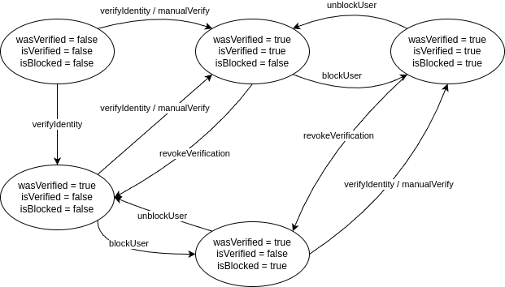

# Extended ERC 20 - BDA (Blockchain and Decentralized Applications)

**Author:** Michal Ľaš (xlasmi00)
**Date:** 02.05.2025

### Elaborate tasks:

- **Smart contract:** 1.1 - 1.9 (all)
- **dApp: skipped** (I don't like frontends, sorry)
- **Documentation:** 3.1 - 3.6 (all)
- **Testing:** 4.1 - 4.3 (all expect 4.4, because of missing dApp)

## Implementation description

> **Task 3.1**

As the development environment I used Foundry and the smart contract itself as well as all scripts and tests are written in _Solidity_ (version **0.8.28**). During development I used the following components from the [OpenZeppelin](https://github.com/OpenZeppelin/openzeppelin-contracts/tree/master) library:

- **ERC20** - the ERC20 implementation itself, which I extended
- **AccessControlEnumerable** - at first I used only the **AccessControl** component, but for the last task which was about voting I changed it to **AccessControlEnumerable**, because for the evaluation of the voting it is necessary to sum the members of each role.
- **ECDSA** and **MessageHashUtils** - for signature verification in the `verifyIdentity` function
- **Strings** - for compiling the message in the prescribed format in the `verifyIdentity` function

The implementation itself corresponds to the individual tasks. The only thing that was perhaps not entirely clear is whether a user who has lost verification can mint new tokens. That is, the specification only mentions that he cannot manipulate his tokens. Therefore, the implementation is currently set up to distinguish between a _never-verified_ user (can not even own tokens) and a _verified user who has lost verification_ (can own, mint new tokens if has `mintingAdmin` role, but can not transfer owned tokens).

- `constructor` - initializes state and roles
- `mint()` - allows to create new tokens only for `mintingAdmin` roles that have ever been verified (they don not need to have current verification). It also checks the maximum amount of tokens created per day, the limit is reset at _00:00 UTC_. All checks are implemented using modifiers.
- `setTransferDailyLimit(user, limit)` - sets the daily token transfer limit for the specified user. Can only be used by the `restrAdmin` role.
- `verifyIdentity(timestamp, signature)` - verify identity using a trusted centralized IDP (identity provider).
- `addTrustedIdp(newIdp) / removeTrustedIdp(idp)` - add/remove a centralized IDP. Can only be used by the `idpAdmin` role.
- `manualVerify(user)` - manually verify the identity for the specified user without using the centralized IDP. Can only be used by the `idpAdmin` role.
- `revokeVerification(user)` - revoke identity verification. Can only be used by the `idpAdmin` role.
- `blockUser(user) / unblockUser(user)` - block/unblock a user. Can only be used by the `idpAdmin` role.
- `voteOnRoleChange(targetUser, role, isAdd)` - vote for the user on a new role. _isAdd_ tells whether the role should be added or removed from the user. If the user should gain a role they already have or lose a role they don not have, then nothing happens and the vote doesn not start. Voting is initiated the first time a vote is cast.
- `_update()` - modification of the original \_update function from the OpenZeppelin library. Adds a check for the user's daily limit and verification checks.

### Resetting daily limits

> **Task 3.3**

I implemented resetting of daily limits using a timestamp from the header of the block in which the transaction is located. This approach is not quite the best, because the block verifier can manipulate this value and it may differ from reality. However, the difference will be in the range of single block utilization, so on Ethereum approximately ~13 seconds. Static analysis using the Slither tool has also highlighted this problem. However, in my opinion, the timestamp from the block can be used for this purpose.

```solidity
TransferLimit storage limitInfo = transferLimits[from];
uint today = block.timestamp - (block.timestamp % 1 days); // UTC midnight alignment
if (today - limitInfo.lastTransferDay >= 1 days) {
    limitInfo.lastTransferDay = today;
    limitInfo.transferredToday = 0;
}
```

## Analysis of the amount of gas used

> **Task 3.4**

- **deployment:** - 4711854
- **minting** - Avg: ~82294, Median: ~106558
- **token transfer** - Avg ~69538, Median: ~79711
- **voting** - Avg: ~98834, Median: ~125568
- **user verification** - Avg: ~94039, Median: ~93404

The most gas is consumed by voting function. The values ​​may vary depending on whether the voting has already started or the first vote has been given (this is when a new voting proposal is **created**). Also, after the voting is closed, the voting is removed. This function requires the most gas because quite a few demanding operations are performed:

1. It is necessary to **create** or access an existing data structure (proposal), verify roles.
2. Verify whether the user giving the vote has not already voted, **record a new vote**.
3. Evaluate the votes, **add a new role**, **delete the vote**.

Writes to the blockchain are generally expensive, which is why this voting function is expensive.

## Finite state machine for address states

> **Task 3.6**

<div align="center">
    
</div>

## Starting the environment

> **Task 3.2**

Local environment is created using **Anvil** tool. To start the tool, just run `$ anvil` in terminal. You can then deploy a contract using `forge create`. **There is also a script** `script/ExtendedERC20.s.sol` for automatic deployment. However, everything mentioned can be done very easily using `Makefile`:

```
make network
make deploy
```

## Testing

> **Task 3.5**

I created the tests during the implementation. First, I wrote the function and then I created tests for it. The tests are divided by name: `test<group><rest of the name>`. I mainly interfered with the EVM with the `prank` function (to set the transaction sender) and `warp` when I tested the daily limit for transfer or minting. I caught errors using `expectRevert` and `expectEmit` with descriptions of errors and emits.

I don not remember the types of errors that I discovered with the tests, because I wrote the tests together with the implementation and debugged them together. However, this approach allowed me to control the development, adding new functionality checked the previous implementation.

> **Task 4.1 and 4.2**

Tests cover the entire implementation (all tasks) and include cases of successful execution as well as failed calls that return exceptions.

Additionally, fuzzing testing has been implemented on the `verifyIdentity` function. I chose fuzzing in this case because signatures and timestamps can take a wide range of values, unlike other functions that usually use only an address in their arguments, or some numeric value like `amount`. In this case, I set fuzzing to a higher value of up to 10000 random values (the default is only 256).

Before each test is performed an initialization in which is set the number of normal `users` (without roles), the number of `mintingAdmins`, the number of `restrAdmins`, the number of `idpAdmins`, the maximum number of created tokens, the daily limit for token creation, and whether initialized users will be automatically verified.

Test Output:

```
Ran 31 tests for test/ExtendedERC20.t.sol:ExtendedERC20Test
[PASS] testAddTrustedIdp() (gas: 4692028)
[PASS] testAddTrustedIdpByNonIdpAdmin() (gas: 4581738)
[PASS] testBlockUser() (gas: 4990412)
[PASS] testDailyLimitResets() (gas: 4854902)
[PASS] testFuzzVerifyIdentity(address,uint256) (runs: 10000, μ: 4493191, ~: 4490844)
[PASS] testManualUserVerification() (gas: 4790946)
[PASS] testMintFailsByNonAdmin() (gas: 4654427)
[PASS] testMintFailsForUnverifiedUser() (gas: 4851571)
[PASS] testMintFailsIfExceedsDailyLimit() (gas: 4823436)
[PASS] testMintFailsIfExceedsMaxSupply() (gas: 4745128)
[PASS] testMintUnderLimitByAdmin() (gas: 4821432)
[PASS] testRemoveTrustedIdp() (gas: 4649912)
[PASS] testRemoveTrustedIdpByNonIdpAdmin() (gas: 4579172)
[PASS] testRemoveUntrustedIdp() (gas: 4674786)
[PASS] testRemoveUserVerification() (gas: 4988545)
[PASS] testReverification() (gas: 4693106)
[PASS] testRoleDeleteAfterExecution() (gas: 5721383)
[PASS] testRoleVoteAddsRole() (gas: 6034032)
[PASS] testRoleVoteDoubleVote() (gas: 5696056)
[PASS] testRoleVoteNotEnough() (gas: 6011763)
[PASS] testRoleVoteNotInRole() (gas: 4875893)
[PASS] testRoleVoteRemovesRole() (gas: 5666882)
[PASS] testTransferAllowedUnderLimit() (gas: 5508453)
[PASS] testTransferFailsOverLimit() (gas: 5461532)
[PASS] testTransferResetNextDay() (gas: 5543782)
[PASS] testUnblockUser() (gas: 4997626)
[PASS] testVerificationExpiration() (gas: 5070179)
[PASS] testVerificationExpirationButCanMint() (gas: 4838890)
[PASS] testVerificationWithInvalidSignature() (gas: 4772939)
[PASS] testVerificationWithUntrustedSigner() (gas: 4620490)
[PASS] testVerificationWithValidSignature() (gas: 4660004)
Suite result: ok. 31 passed; 0 failed; 0 skipped; finished in 6.78s (6.85s CPU time)

Ran 1 test suite in 6.78s (6.78s CPU time): 31 tests passed, 0 failed, 0 skipped (31 total tests)
```

### Static analysis using Slither

> **Task 4.3**

Slither found a number of problems, but mostly they were related to the used libraries. For the `ExtendedERC20` contract code, Slither found only two problems:

1. **The use of `block.timestamp` for checking mints and transfers**. Slither correctly identified this as a possible problem. The details was mentioned before. In short the problem relates to the fact that `block.timestamp` can be manipulated and thus the value of `block.timestamp` cannot be relied upon to always be correct, so it should not be used for the checks (conditions) that are important for smartcontract.

```
ExtendedERC20.mint(address,uint256) (src/ExtendedERC20.sol#190-210) uses a weak PRNG: "today = block.timestamp - (block.timestamp % 86400) (src/ExtendedERC20.sol#195)"
ExtendedERC20._update(address,address,uint256) (src/ExtendedERC20.sol#389-414) uses a weak PRNG: "today = block.timestamp - (block.timestamp % 86400) (src/ExtendedERC20.sol#398)"
Reference: https://github.com/crytic/slither/wiki/Detector-Documentation#weak-PRNG
```

2. **Deletion on mapping containing a structure**. This error basically just points out that `delete mapping[...]` does not delete the entire mapping, but only one item, which is correct and the code was intended to do so.

```
ExtendedERC20.voteOnRoleChange(address,bytes32,bool) (src/ExtendedERC20.sol#332-378) deletes ExtendedERC20.RoleProposal (src/ExtendedERC20.sol#66-73) which contains a mapping:
        -delete roleProposals[proposalId] (src/ExtendedERC20.sol#375)
Reference: https://github.com/crytic/slither/wiki/Detector-Documentation#deletion-on-mapping-containing-a-structure
```
