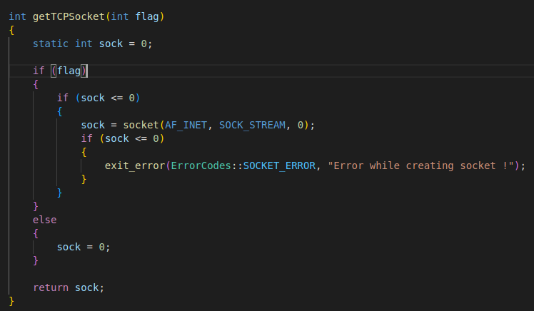
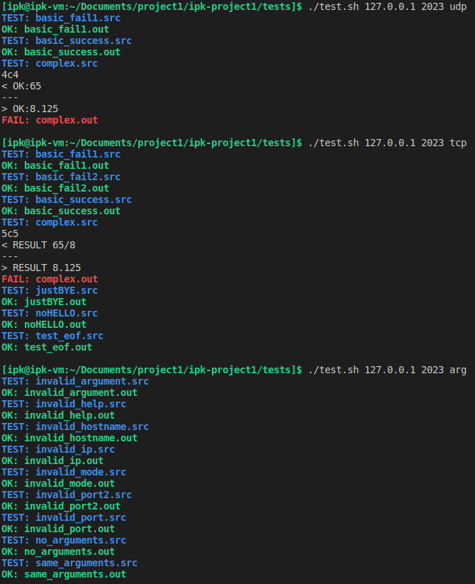
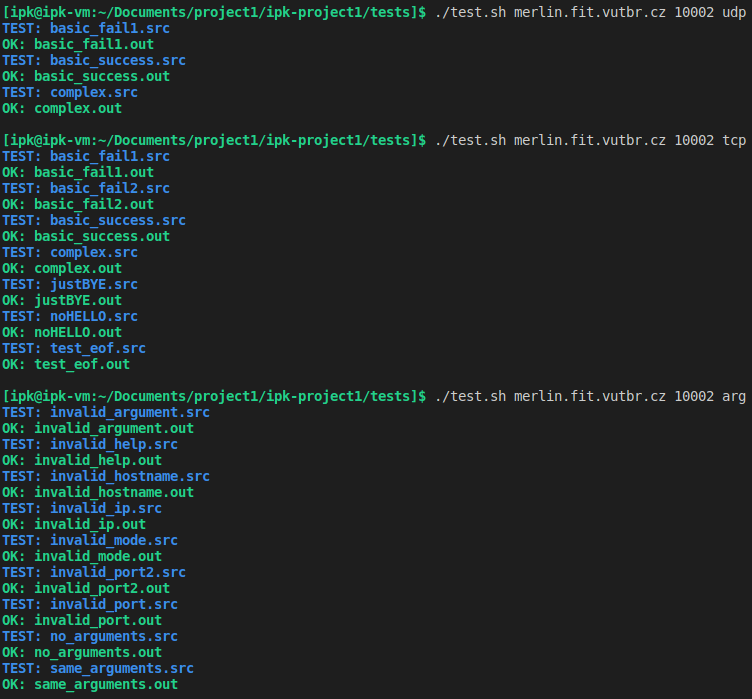

# ipk-project1

## Table of contents
1. [Executive summary](#Sumary)
2. [Functionality](#Functionality)
3. [Testing](#Testing)
4. [Bibliography](#Bibliography)


## Summary of the theory

The main part of this project is focused on communication using TCP and UDP protocols. Here are explained some important characteristics for TCP and UDP that were used in this project:

- **UDP (User Datagram Protocol)**: The simplest possible protocol of the transport layer, (connection-less) there is no handshake between the sender and the receiver. This protocol is therefore unreliable, it does not guarantee the delivery of sent packages or the order in which they will be delivered.

- **TCP (Transmission Control Protocol)**: Unlike the UDP, TCP is a point-to-point connection. It requires a handshake between the sender and receiver. This protocol preserves the order of the sent bytes (in-order-byte stream) and at the same time the receiver sends back a acknowledgment about the received bytes. So it is a reliable data transfer.


If the UDP protocol is used, a special header according to the [IPKCP](https://git.fit.vutbr.cz/NESFIT/IPK-Projekty/src/branch/master/Project%201/Protocol.md) protocol is attached to the sent message. Messages sent using TCP use a text variant of the IPKCP protocol that uses the keywords HELLO, SOLVE, and BYE.

### Other important terms

- **Port** is a logical address used by networking protocols to identify a specific process or application running on a computer that is communicating over a network. Ports could be in range from 0 to 65 535. The special reserved ports are in range from 0 to 1023. Those ports are for well-known services, such as HTTP (port 80), FTP (port 21), HTTPS (443), etc. [2]
- **IPv4** is a widely used network protocol that is used for transmitting data over the Internet. This protocol is used by devices on a network to identify and communicate with each other. [4]
- **Hostname** is a unique name that identifies a device on a network. [3]
- **Socket** is an endpoint of a two-way communication link between two programs running over a network. It is a software structure that provides a way for programs to communicate with each other over a network by sending and receiving data. [1]

## Functionality

### Basic functionality

The ipkcpc is the client for the [IPK Calculator Protocol](https://git.fit.vutbr.cz/NESFIT/IPK-Projekty/src/branch/master/Project%201/Protocol.md). This program can use either UDP or TCP depending on the selected mode. The program reads the list of commands from STDIN (each instruction on one line) and returns the received response from the server to STDOUT.


### Program arguments and execution

The program needs 3 arguments:
- **-h \<host>** IPv4 address of the server or Hostname of server
- **-p \<port>** port
- **-m \<mode>** tcp/udp

The program information can be printed with single **--help** argument:
- ```./ipkcpc --help```

Program execution example:

- ```./ipkcpc -h <host> -p <port> -m <mode>```
- ```./ipkcpc -h 127.0.0.1 -p 2023 -m tcp```
- ```./ipkcpc -h 147.229.176.19 -p 10002 -m udp```


### Extra functionality

This implementation also offers the possibility to connect to the server with server's hostname.

Example:
- ```./ipkpcp -h merlin.fit.vutbr.cz -p 10002 -m udp```


### Interesting source code sections

Function for handling interrupt signal (C-c):

<div align="center">
    
</div>

The function stores the socket descriptor in a static variable. In this way, when the function is called, it always return an existing socket descriptor or create a new one. The flag is used to choose if the socket descriptor should be returned or reset to 0. The reset is only happening when socket wants to close (when the ```closeSocket()``` function is called). 


## Testing

- Compiled with g++ 20  
- Bash version 5.1.16
  
The main part of the project is focused on the use of communication using UDP and TCP protocols, so testing was also focused on this functionality.
  
For this purpose, there is a ```test.sh``` script in the ```tests``` folder with three test suites for TCP, UDP and program argument testing.
  
Example of running a test script:
- ```./test.sh <host> <port> <mode>```
    - **\<host>** IPv4 address of the server or Hostname of server
    - **\<port>** port
    - **\<mode>** tcp/udp/arg
  
Testing was done on the provided virtual machine using local host and also using a server deployed on student server merlin.


<div align="center">
    
    
</div>


Tests that fail are just different represantation of output presented from server. More images from testing are in ```tests``` directory.


### Interruption with C-c signal

```
./ipkcpc -h 127.0.0.1 -p 2023 -m tcp
HELLO
HELLO
^CBYE
```

```
./ipkcpc -h 127.0.0.1 -p 2023 -m udp
(+ 5 18)
OK:23
^C
```


## Bibliography

[1] *Network socket*. In: Wikipedia: the free encyclopedia [online]. San Francisco (CA): Wikimedia Foundation, 2006 [cit. 2023-03-21]. Available at: https://en.wikipedia.org/wiki/Network_socket

[2] *Port (computer networking)*. In: Wikipedia: the free encyclopedia [online]. San Francisco (CA): Wikimedia Foundation, 2006 [cit. 2023-03-21]. Dostupné z: https://en.wikipedia.org/wiki/Port_(computer_networking)

[3] *Hostname*. In: Wikipedia: the free encyclopedia [online]. San Francisco (CA): Wikimedia Foundation, 2004 [cit. 2023-03-21]. Available at: https://en.wikipedia.org/wiki/Hostname

[4] *Internet Protocol version 4*. In: Wikipedia: the free encyclopedia [online]. San Francisco (CA): Wikimedia Foundation, 2001 [cit. 2023-03-21]. Available at: https://en.wikipedia.org/wiki/Internet_Protocol_version_4

[5] DOLEJŠKA Daniel and Michal KOUTENSKÝ, *Programování síťových aplikací* [online]. Brno: Brno University of Technology, Faculty of information technology, 2023 [cit. 2023-03-21]. Available at: Moodle VUT
