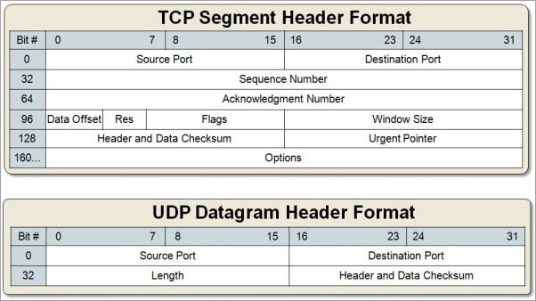
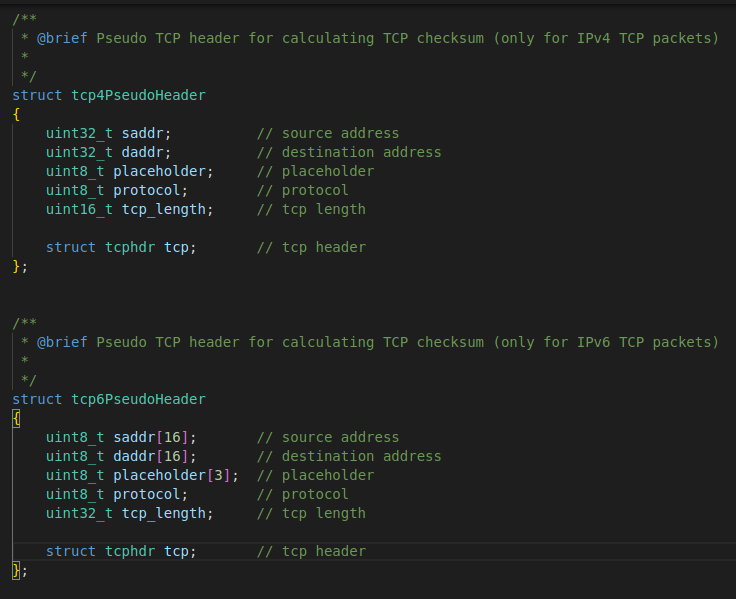
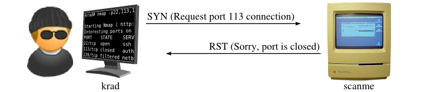
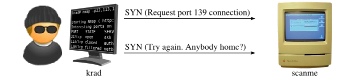
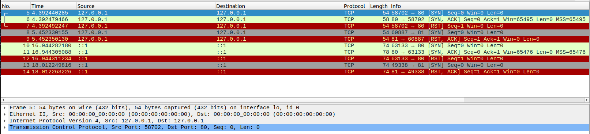
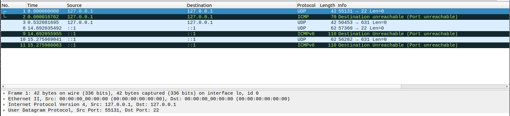

# ipk-project2

## Table of contents
1. [Executive summary](#Summary)
2. [Functionality](#Functionality)
3. [Testing](#Testing)
4. [Bibliography](#Bibliography)


## Summary of the theory
---

### Port scanner

It is an application that looks for ports that are open on the provided IP address/hostname. Port scanning is performed, for example, to administer network security, or it can be misused to identify network services running on a device.[1]

### IPv4 and IPv6 address (header)

For port scanning, it is necessary to create a so-called RAW network packet. It is a packet of data that is sent or received over a computer network without being processed or modified by higher-level protocols or applications.

To create such a packet, it is necessary to manually create an IP header. The picture shows IPv4 and IPv6 address porting and the attributes that the header should contain.

<div align="center">
    
</div>

(image from [4])

### TCP and UDP header

It is also necessary to manually create a TCP or UDP header. The picture shows which attributes the TCP and UDP header should contain.

<div align="center">
    
</div>

(image from [5])


### Checksum

It is important to calculate the `checksum` correctly for IPv4, TCP and UDP, otherwise the packet may be discarded. IPv6 does not contain a `checksum`, but if an IPv6 address is used, the TCP/UDP `checksum` also includes IPv6, see [rfc2460](https://www.rfc-editor.org/rfc/rfc2460.html#page-27) alebo [7].

For this purpose, so-called pseudo headers are implemented in the code, which are used to calculate the TCP and UDP `checksum`.

<div align="center">
    
</div>

The UDP header looks the same, only instead of `struct tcphdr` it contains `struct udphdr`. In this case, the pseudo headers do not contain any payload data (because none is sent), however, if the packet contains some payload data, it must be included in the `checksum` calculation.

### TCP SYN scanning

TCP SYN scanning is based on the principle of 'incomplete' 3 way handshake. 3 different cases can occur:
1. After sending a packet with a SYN message, the target responds with a SYN ACK message, which means that it is possible to establish a connection and the port is open. After this, the RST packet is sent to prevent the completion of a 3 way handshake.

<div align="center">
    
</div>

2. The target responds with an RST message, which means that the port is closed.  

<div align="center">
    
</div>

3. The target does not respond to the sent SYN packet, so it is probably filtered.

<div align="center">
    
</div>

(images from [2])

### UDP scanning

When scanning UDP ports, 2 cases can occur:
1. If the target does not respond, the port is open (or filtered).
2. If the target responds with an ICMP message of type 3, code 3, i.e. (port unreachable), then the port is closed.

## Functionality
---

### Basic functionality

ipk-l4-scan is a simple TCP and UDP network L4 scanner. The program works with both IPv4 and IPv6 addresses.

After processing the input arguments, the ipk-l4-scan program creates IP, TCP and UDP headers and starts scanning individual ports. The sent packet looks like this: `[datalink header + ip header + tcp/udp header]`. In case of interruption by the `C-c` signal, both TCP and UDP sockets are closed before the program ends.

### Program arguments and execution

```
./ipk-l4-scan [-i interface | --interface interface] [--pu port-ranges | --pt port-ranges | -u port-ranges | -t port-ranges] {-w timeout} [domain-name | ip-address]
```

+ **-h/--help:** prints help message to terminal
+ **-i/--interface:** interface to scan through
+ **-p/-pu:** port-ranges for scanning UDP ports
+ **-t/--pt:** port-ranges for scanning TCP ports
+ **-w/--wait:** timeout in milliseconds to wait for a response for a single port scan (by default is set to 5000)
+ **ip-address/domain-name:** target of scanning (fully qualified domain name or IPv4/IPv6 address)

port-ranges could be given in 3 different formats:
1. As a single port (`-t 80`, `-u 600`)
2. As multiple ports separated by comma (`--pu 22-50`)
3. As port range (`--pt 80-100`)

**Execution examples**

```
./ipk-l4-scan --interface eno1 --pu 22,23 147.229.188.59
./ipk-l4-scan -i eth0 -w 1500 -t 80-400 localhost
./ipk-l4-scan ::1 -i lo -w 1500 -t 443
```

```
./ipk-l4-scan -i
./ipk-l4-scan --interface
```

When the single `-i/--interface` argument is given or no arguments are given, the program prints list of the active interfaces

```
./ipk-l4-scan -h
./ipk-l4-scan --help
```

When the single `-h/--help` argument is given, the program prints help message

### Extra functionality

*no extra functionality implemented* 


## Testing
---

+ Testing was done on the provided virtual machine (NixOs) and on Ubuntu 22.04 with scanning local host ports and scanning computer ports from the virtual machine
+ All tests were done with `sudo` command because sending raw sockets requires administrator rights
+ Compiled with g++ 20

Port scans using the ipk-l4-scan program were compared with results from the open source program `nmap` and individual field packets were monitored using the `wireshark` program.

### TCP scanning

**IPv4**

```
sudo ./ipk-l4-scan -i lo --pt 80,81 127.0.0.1

Interesting ports on IP address (127.0.0.1):
PORT STATE
80/tcp open
81/tcp closed
```

**IPv6**

```
sudo ./ipk-l4-scan -i eno1 -t 80,81 ip6_localhost

Interesting ports on IP address (::1):
PORT STATE
80/tcp open
81/tcp closed
```

<div align="center">
    
</div>


### UDP scanning

**IPv4**

```
sudo ./ipk-l4-scan -i eno1 -u 22,631 localhost

Interesting ports on localhost (127.0.0.1):
PORT STATE
22/udp closed
631/udp open
```

**IPv6**

```
sudo ./ipk-l4-scan -i lo -u 22,631 ::1
Interesting ports on IP address (::1):
PORT STATE
22/udp closed
631/udp closed
```

<div align="center">
    
</div>


The test results match results of port scanning done by program `nmap`.


## Bibliography
---

[1] *Port scanner*. In: Wikipedia: the free encyclopedia [online]. San Francisco (CA): Wikimedia Foundation, 25 February 2023 [cit. 2023-04-13]. Available at: https://en.wikipedia.org/wiki/Port_scanner

[2] *TCP SYN (Stealth) Scan (-sS)*. In nmap.org [online], [cit. 2023-04-13]. Available at: https://nmap.org/book/synscan.html

[3] *UDP Scan (-sU)* In namp.org [online], [cit. 2023-04-13]. Available at: https://nmap.org/book/scan-methods-udp-scan.html

[4] *IPv4 vs IPv6 - Understanding the differences* In networkacademy.io [online], [cit. 2023-04-13]. Available at: https://www.networkacademy.io/ccna/ipv6/ipv4-vs-ipv6

[5] *TCP Vs UDP – What Is The Difference Between TCP And UDP*. In SoftwareTestingHelp.com [online], 24 March 2023 [cit. 2023-04-13]. Available at: https://www.softwaretestinghelp.com/tcp-vs-udp/

[6] David Hoze, *IP Header Checksum Calculation Implementation* [online], 31 October 2019 [cit. 2023-04-13]. Available at: https://gist.github.com/david-hoze/0c7021434796997a4ca42d7731a7073a

[7] *Transmission Control Protocol*. In: Wikipedia: the free encyclopedia [online]. San Francisco (CA): Wikimedia Foundation, 14 April 2023 [cit. 2023-04-15]. Available at: https://en.wikipedia.org/wiki/Transmission_Control_Protocol#TCP_checksum_for_IPv6